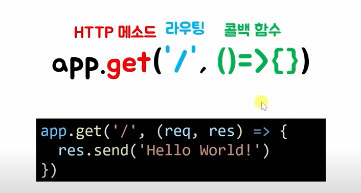

# 필기노트
[조코딩 Node.js 백엔드 기초 끝내기 (ft.API 구축)](https://www.youtube.com/watch?v=Tt_tKhhhJqY&t=585s)
## npm 시작
- `npm init` -> package.json 이 생성됨.
    - 설치된 모듈을 깔끔하게 정리해서 관리하기위함.
- `node index.js` 를 통해 js코드를 실행시킬 수 있다.
### figlet 모듈
- `npm install figlet` 을 통해 figlet 을 다운받아주자.
    - 현재 경로에서만 figlet을 사용할 수 있게 한다.
    - 뒤에 옵션 `-g`를 붙이면 내컴퓨터의 모든공간에서 figlet을 사용할 수 있게된다.
    - package-lock.json이 생기게되는데, package.json에 들어가서 보면 
        ```json
        "dependencies": {
            "figlet": "^1.7.0"
        }
        ```
        이 나타나는 것을 볼 수 있다. 1.5.2버전때 이 모듈이 설치가 되었다는걸 대략적으로 볼 수 있고, package-lock에서는 조금더 자세히 그 정보를 볼 수 있다.
    - node_modules 디렉토리에보면, figlet에 설치된 것을 볼 수 있다.
    - 공식 문서를 보고, 어떻게 쓰는지 예시 코드를 사용해보자.
- `npm uninstall figlet`으로 모듈 삭제도 가능.

### express 모듈
- node.js 를 사용해서 웹 프레임워크를 만든다.
    - 웹프레임워크 : 프론트엔드에서 요청을보내고, 백엔드에서 응답을 보내는 그러한 일하는 하는것
- `npm install express`를 통해 express를 설치해주자.
    ```js
    const express = require('express')
    const app = express()

    app.get('/', function (req, res) {
    res.send('Hello World')
    })

    app.listen(3000)
    ```
    를 통해 서버를 열어주면, "localhost:3000" 에 접속해보면, hello world가 출력됨을 볼 수 있다.
    - `Ctrl C`를 통해 서버를 끌 수 있다.
    - [express 공식 홈페이지](https://expressjs.com/ko/starter/hello-world.html)
    ```js
    const express = require('express')
    const app = express()
    const port = 3000

    app.get('/', (req, res) => {
    res.send('Hello World!')    //응답에 Hello World라는 문자를 담아 보내겠다 !
    })

    app.listen(port, () => {    //()는 함수, => 이건 그냥 출력해줄라 쓴거라 안써도됨
    console.log(`Example app listening on port ${port}`)
    })
    ```
    #### app.listen?
    - 3000포트에 대해 듣고있었는데 (항상. listen하며 기다리고있었는데), port 3000으로 들어오면(서버를 키면), listen이 실행되고나서, {}가 실행되겠다 라는 뜻
    
    
    #### 포트 (Port)
    - [포트 규격](https://ko.wikipedia.org/wiki/TCP/UDP%EC%9D%98_%ED%8F%AC%ED%8A%B8_%EB%AA%A9%EB%A1%9D)
    - 포트가 듣고있어야, 내부적으로 서버에 접속했을때 프로그램이 실행돼서 응답가능
    
    #### app.get?
    - http로 들어온것중에 get메소드로 들어온것을 받겠다.
    
    - app.get 으로 라우팅이 /(root) 들어왔을때 get함수가 실행되면 그다음에 (파라미터?)->{}코드를 실행하라.
    - 주소창을 이용해 접속을 한다 ? == get 방식 으로 주소창에 입력했다.

    #### HTTP메소드 : 요청의 목적, 종류를 알리는 수단
    - GET 방식 : 주소창에서 뭔가 데이터를 전달
    - POST 방식 : 주소창이 아니라 바디에 어떤 정보를 담아 어떤 요청을 전달
    
    #### 라우팅 (Routing)
    - 홈페이지주소 뒤에 붙는 /dasdwa/sadawd/sdawdsa 이런게 라우팅임.
    - `/` 기본주소

    ### 콜백함수 (callback)
    - 함수(끝나고 실행할 함수)
    - ex) setTimeout(()=>{},1000)   //1000ms뒤에 ()=>{}이라는 콜백함수를 수행하라.
    - 보통 함수실행 순서를 정해줄 때 사용. 나중에 실행될 함수를 {}부분에 넣어준다.

# 필기노트 2
[nodejs express mysql 웹사이트만들기](https://www.youtube.com/watch?v=hfKmOazBEEQ&list=LL&index=5)
## ejs 설치
- `npm install ejs`
- ! + Tab 누르면 일반적인 html 태그들(코드들)이 나온다.

- 실행시킨 js를 수정하면 서버를 끄고 다시 켜야지 적용이되고, 그냥 연결된 ejs같은애들을 수정하면 굳이 껐다 킬 필욘없다.

- [phpmyadmin 설치](https://program.shstory.co.kr/web/php-%EC%84%A4%EC%B9%98/) 를 참고하여 연결시켰다.

- lib라는 데이터베이스를 phpmyadmin에서 만들고, mysql workbench에서 contact라는 테이블을 만들어 idx, name, phone, email, memo, regdate를 속성으로 만들어준후 apply로 적용시켜줬다.
- .env 를 최상위폴더에넣고, 환경변수 설정을해줘야한다. 이건 모르겠다......***
- `npm install mysql2`를 해준다.
- `npm install dotenv`를 해준다.
```js
const dotenv = require("dotenv");
const mysql = require("mysql2");

dotenv.config();

const connection = mysql.createConnection({
  host     : 'localhost',
  user     : process.env.DATABASE_USERNAME || 'root',
  password : process.env.DATABASE_PASSWORD || '1234',
  database : process.env.DATABASE_NAME || 'lib'
});
```
를 추가해서 db를 연결시키고ㅡ 
```js
app.post('/contactProc', (req, res) => {
    const { name, phone, email, memo } = req.body;

    const sql = 'INSERT INTO contact (name, phone, email, memo) VALUES (?, ?, ?, ?)';

    connection.query(sql, [name, phone, email, memo], function(err, result) {
        if (err) {
            throw err;
        }
        console.log("자료 1개를 삽입");
        res.send("<script>alert('문의사항 등록'); location.href='/'; </script>");
    });

    const a = `${name} ${phone} ${email} ${memo}`;

});
```
이걸로, 버튼누르면 db에 저장이 되도록 만들어주면 완성.